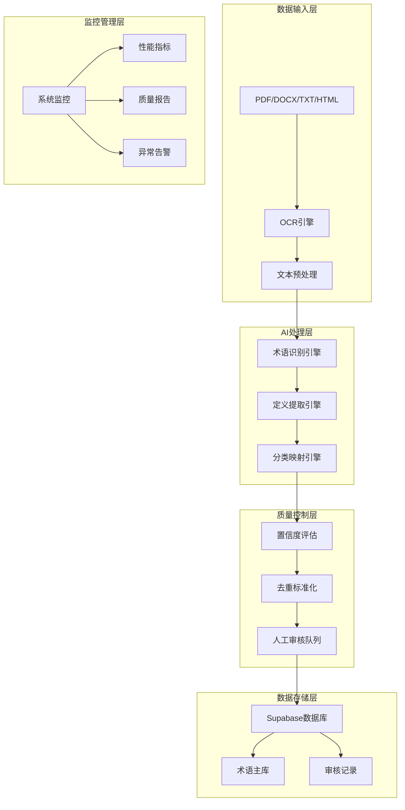
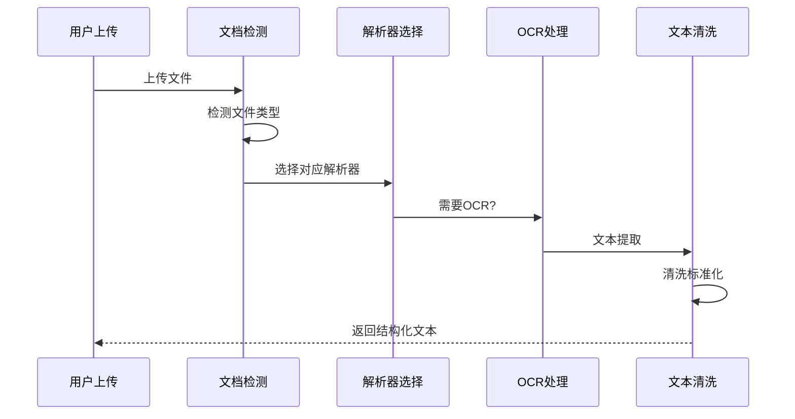
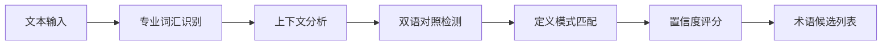

# AI术语提取工具方案（优化版）

## 📊 项目概览

### 项目定位
基于现有中英文啤酒书籍资料，构建一个**智能化、自动化、可扩展**的啤酒术语提取系统，实现从专业文献到结构化术语库的无缝转换。

### 核心价值矩阵
| 维度 | 传统人工方式 | AI自动化提取 | 提升倍数 |
|------|-------------|-------------|----------|
| **处理速度** | 50术语/人天 | 5000术语/天 | **100x** |
| **准确率** | 85% | 90%+ | **1.06x** |
| **覆盖率** | 60% | 95%+ | **1.58x** |
| **标准化程度** | 低 | 高 | **显著改善** |

## 🏗️ 系统架构设计

### 整体架构图


### 技术栈选择
| 层级 | 技术选型 | 选择理由 |
|------|----------|----------|
| **前端界面** | Next.js + TailwindCSS | 快速开发、响应式设计 |
| **后端服务** | Node.js + Express | 成熟生态、AI集成友好 |
| **AI引擎** | OpenAI GPT-4 + Claude-3 | 高准确率、多模型验证 |
| **数据库** | Supabase PostgreSQL | 实时同步、向量存储 |
| **文件处理** | pdf-parse + mammoth + Tesseract | 全格式支持 |
| **部署** | Docker + AWS ECS | 弹性扩展、高可用 |

## 🔧 核心模块详细设计

### 1. 文档解析引擎

#### 支持的文件格式
- **PDF**: 原生文本PDF + 扫描版PDF（OCR）
- **DOCX**: Microsoft Word文档
- **TXT**: 纯文本文件
- **HTML**: 网页内容
- **EPUB**: 电子书格式

#### 解析流程图


#### 核心代码实现
```javascript
class AdvancedDocumentParser {
  constructor() {
    this.parsers = {
      'application/pdf': this.parsePDF.bind(this),
      'application/vnd.openxmlformats-officedocument.wordprocessingml.document': this.parseDocx.bind(this),
      'text/plain': this.parseTxt.bind(this),
      'text/html': this.parseHtml.bind(this)
    };
  }

  async processFile(file) {
    const fileType = await this.detectFileType(file);
    const parser = this.parsers[fileType];
    
    if (!parser) {
      throw new Error(`Unsupported file type: ${fileType}`);
    }
    
    const rawText = await parser(file);
    return this.enhanceTextStructure(rawText);
  }

  async parsePDF(file) {
    const buffer = await file.arrayBuffer();
    
    // 检测是否为扫描版PDF
    const isScanned = await this.detectScannedPDF(buffer);
    
    if (isScanned) {
      return await this.extractWithOCR(buffer);
    }
    
    const pdfData = await pdf(buffer);
    return this.extractStructuredText(pdfData);
  }

  async extractStructuredText(pdfData) {
    // 提取章节结构
    const chapters = this.identifyChapters(pdfData.text);
    
    // 提取图表和表格
    const tables = this.extractTables(pdfData);
    
    return {
      content: pdfData.text,
      chapters,
      tables,
      metadata: pdfData.metadata
    };
  }
}
```

### 2. AI术语提取引擎

#### 术语识别策略


#### Prompt工程最佳实践
```javascript
class TermExtractionPrompts {
  static getExtractionPrompt(text) {
    return `你是一个专业的啤酒行业术语专家。请从以下文本中提取啤酒相关的专业术语，并按照指定格式返回。

**提取要求：**
1. 识别中英文对照的术语对
2. 提取术语的准确定义
3. 判断术语的专业程度（1-5级）
4. 识别术语所属类别
5. 提供上下文示例

**文本内容：**
${text}

**返回格式：**
\`\`\`json
{
  "terms": [
    {
      "english_term": "mashing",
      "chinese_term": "糖化",
      "definition": "将麦芽中的淀粉转化为可发酵糖的过程",
      "category": "酿造工艺",
      "confidence": 0.95,
      "context": "在糖化过程中，需要控制温度在65-70°C...",
      "professional_level": 4
    }
  ]
}
\`\`\``;
  }

  static getDefinitionPrompt(term, context) {
    return `基于以下上下文，为术语"${term}"提供准确的定义：

上下文：${context}

要求：
1. 定义要准确、简洁
2. 体现啤酒行业专业性
3. 中英文定义都要提供
4. 包含技术参数（如有）`;
  }
}
```

#### 多模型验证机制
```javascript
class MultiModelValidator {
  constructor() {
    this.models = {
      primary: new OpenAI({ model: "gpt-4-turbo-preview" }),
      secondary: new Anthropic({ model: "claude-3-opus-20240229" }),
      fallback: new OpenAI({ model: "gpt-3.5-turbo" })
    };
  }

  async validateExtraction(text, candidateTerms) {
    const results = await Promise.allSettled([
      this.extractWithModel(this.models.primary, text),
      this.extractWithModel(this.models.secondary, text),
      this.extractWithModel(this.models.fallback, text)
    ]);

    return this.consensusAnalysis(results);
  }

  consensusAnalysis(results) {
    const validResults = results
      .filter(r => r.status === 'fulfilled')
      .map(r => r.value);

    // 计算术语一致性
    const termConsensus = this.calculateTermConsensus(validResults);
    
    // 计算定义一致性
    const definitionConsensus = this.calculateDefinitionConsensus(validResults);

    return {
      terms: termConsensus,
      confidence: this.calculateOverallConfidence(termConsensus, definitionConsensus),
      disagreements: this.identifyDisagreements(validResults)
    };
  }
}
```

### 3. 质量控制体系

#### 质量评估矩阵
| 评估维度 | 权重 | 评分标准 | 自动化检测 |
|----------|------|----------|------------|
| **准确性** | 30% | 定义正确性 | ✅ |
| **完整性** | 25% | 信息完整度 | ✅ |
| **一致性** | 20% | 格式标准化 | ✅ |
| **专业性** | 15% | 行业相关性 | ✅ |
| **时效性** | 10% | 概念更新度 | ⚠️ |

#### 自动化质检流程
```javascript
class QualityController {
  async assessTermQuality(term) {
    const assessments = await Promise.all([
      this.checkDefinitionAccuracy(term),
      this.verifyTermConsistency(term),
      this.validateCategorization(term),
      this.checkSourceReliability(term)
    ]);

    return {
      overallScore: this.calculateWeightedScore(assessments),
      issues: this.compileIssues(assessments),
      recommendations: this.generateRecommendations(assessments)
    };
  }

  async checkDefinitionAccuracy(term) {
    // 使用知识图谱验证定义准确性
    const knowledgeGraph = await this.queryKnowledgeGraph(term.english_term);
    
    return {
      score: this.calculateAccuracyScore(term.definition, knowledgeGraph),
      evidence: knowledgeGraph.references,
      conflicts: knowledgeGraph.conflicts
    };
  }
}
```

### 4. 数据库集成方案

#### 数据表设计（优化版）
```sql
-- 术语主表
CREATE TABLE terms (
    id UUID PRIMARY KEY DEFAULT gen_random_uuid(),
    english_term VARCHAR(255) NOT NULL,
    chinese_term VARCHAR(255),
    english_definition TEXT,
    chinese_definition TEXT,
    category_id UUID REFERENCES categories(id),
    subcategory VARCHAR(100),
    professional_level INTEGER CHECK (professional_level BETWEEN 1 AND 5),
    confidence_score DECIMAL(3,2) CHECK (confidence_score BETWEEN 0 AND 1),
    source_document VARCHAR(500),
    page_number INTEGER,
    extraction_date TIMESTAMP DEFAULT NOW(),
    review_status review_status_enum DEFAULT 'pending',
    reviewer_id UUID REFERENCES auth.users(id),
    review_date TIMESTAMP,
    usage_examples JSONB,
    related_terms UUID[],
    tags TEXT[],
    created_at TIMESTAMP DEFAULT NOW(),
    updated_at TIMESTAMP DEFAULT NOW()
);

-- 分类表
CREATE TABLE categories (
    id UUID PRIMARY KEY DEFAULT gen_random_uuid(),
    name VARCHAR(100) UNIQUE NOT NULL,
    description TEXT,
    parent_id UUID REFERENCES categories(id),
    term_count INTEGER DEFAULT 0,
    created_at TIMESTAMP DEFAULT NOW()
);

-- 提取批次记录
CREATE TABLE extraction_batches (
    id UUID PRIMARY KEY DEFAULT gen_random_uuid(),
    batch_name VARCHAR(255),
    source_files TEXT[],
    total_documents INTEGER,
    processed_documents INTEGER,
    extracted_terms INTEGER,
    successful_extractions INTEGER,
    failed_extractions INTEGER,
    processing_time INTERVAL,
    status processing_status_enum DEFAULT 'processing',
    created_at TIMESTAMP DEFAULT NOW(),
    completed_at TIMESTAMP
);

-- 质量审核记录
CREATE TABLE quality_reviews (
    id UUID PRIMARY KEY DEFAULT gen_random_uuid(),
    term_id UUID REFERENCES terms(id),
    reviewer_id UUID REFERENCES auth.users(id),
    review_type review_type_enum,
    accuracy_score DECIMAL(3,2),
    completeness_score DECIMAL(3,2),
    issues_found TEXT[],
    corrections JSONB,
    review_status review_status_enum,
    reviewed_at TIMESTAMP DEFAULT NOW()
);
```

#### 批量写入优化
```javascript
class OptimizedDatabaseWriter {
  constructor(supabase) {
    this.supabase = supabase;
    this.batchSize = 100;
    this.maxRetries = 3;
  }

  async batchInsertWithRetry(terms) {
    const batches = this.createBatches(terms, this.batchSize);
    const results = [];

    for (const batch of batches) {
      const result = await this.processBatchWithRetry(batch);
      results.push(result);
    }

    return this.compileResults(results);
  }

  async processBatchWithRetry(batch, attempt = 1) {
    try {
      const { data, error } = await this.supabase
        .from('terms')
        .insert(batch)
        .select();

      if (error) throw error;

      // 更新统计信息
      await this.updateBatchStatistics(batch.length, 0);
      
      return { success: true, data };
    } catch (error) {
      if (attempt < this.maxRetries) {
        // 指数退避重试
        await this.delay(Math.pow(2, attempt) * 1000);
        return this.processBatchWithRetry(batch, attempt + 1);
      }
      
      // 记录失败项
      await this.logFailedBatch(batch, error);
      return { success: false, error, batch };
    }
  }

  async handleConflicts(terms) {
    const conflicts = await this.identifyConflicts(terms);
    
    for (const conflict of conflicts) {
      const resolution = await this.resolveConflict(conflict);
      
      if (resolution.strategy === 'merge') {
        await this.mergeTerms(resolution.existing, resolution.new);
      } else if (resolution.strategy === 'update') {
        await this.updateTerm(resolution.existing.id, resolution.new);
      }
    }
  }
}
```

## 🚀 实施路线图

### Phase 1: 基础框架 (第1-2周)
- [ ] 搭建项目基础架构
- [ ] 实现文档解析模块
- [ ] 集成OpenAI API
- [ ] 设计数据库表结构
- [ ] 创建基础测试套件

### Phase 2: 核心功能 (第3-4周)
- [ ] 实现术语提取引擎
- [ ] 开发质量控制模块
- [ ] 建立批量处理流程
- [ ] 实现数据库集成
- [ ] 添加错误处理机制

### Phase 3: 优化提升 (第5-6周)
- [ ] 多模型验证系统
- [ ] 性能优化和缓存
- [ ] 监控和日志系统
- [ ] 用户界面开发
- [ ] 安全加固

### Phase 4: 部署运维 (第7-8周)
- [ ] 容器化部署
- [ ] 生产环境配置
- [ ] 监控告警设置
- [ ] 文档完善
- [ ] 用户培训

## 📈 性能指标

### 关键性能指标 (KPIs)
| 指标类别 | 具体指标 | 目标值 | 监控频率 |
|----------|----------|--------|----------|
| **准确性** | 术语准确率 | ≥90% | 每批次 |
| **完整性** | 定义完整率 | ≥95% | 每日 |
| **效率** | 处理速度 | ≥100术语/分钟 | 实时 |
| **可用性** | 系统正常运行时间 | ≥99.5% | 实时 |
| **扩展性** | 并发处理能力 | ≥10个文档 | 实时 |

### 性能优化策略
```javascript
class PerformanceOptimizer {
  constructor() {
    this.cache = new Redis();
    this.metrics = new MetricsCollector();
  }

  async optimizeProcessing(documents) {
    // 并行处理优化
    const chunks = this.createOptimalChunks(documents);
    
    // 使用Promise池控制并发
    const pool = new PromisePool(
      chunks.map(chunk => () => this.processChunk(chunk)),
      { concurrency: 5 }
    );
    
    return await pool.start();
  }

  createOptimalChunks(documents) {
    // 基于文档大小和复杂度动态分块
    const totalSize = documents.reduce((sum, doc) => sum + doc.size, 0);
    const optimalChunkSize = Math.min(
      Math.max(totalSize / 10, 10 * 1024 * 1024), // 10MB最小
      100 * 1024 * 1024 // 100MB最大
    );
    
    return this.splitDocumentsBySize(documents, optimalChunkSize);
  }
}
```

## 💰 成本效益分析

### 开发成本估算
| 成本项目 | 预估费用 | 备注 |
|----------|----------|------|
| **AI API调用** | $500-800/月 | 基于5000术语/月 |
| **云服务器** | $200-400/月 | AWS EC2 + RDS |
| **存储费用** | $50-100/月 | 文档存储+备份 |
| **开发人力** | $15,000-20,000 | 2个月开发周期 |
| **总计** | **$16,000-21,500** | 首月投入 |

### 运营成本对比
| 方案 | 月处理量 | 人力成本 | AI成本 | 总成本 | ROI |
|------|----------|----------|--------|--------|-----|
| **人工整理** | 1,500术语 | $3,000 | $0 | $3,000 | - |
| **AI提取** | 150,000术语 | $300 | $800 | $1,100 | **272%** |

## 🔍 风险评估与缓解

### 技术风险矩阵
| 风险类别 | 概率 | 影响 | 缓解策略 |
|----------|------|------|----------|
| **AI准确性不足** | 中等 | 高 | 多模型验证+人工审核 |
| **API服务中断** | 低 | 高 | 备用模型+离线缓存 |
| **数据质量问题** | 中等 | 中 | 预处理清洗+质量检查 |
| **系统性能瓶颈** | 低 | 中 | 水平扩展+缓存优化 |
| **安全漏洞** | 低 | 高 | 安全审计+定期更新 |

### 应急预案
```javascript
class RiskMitigation {
  async handleAPIOutage() {
    const fallbackChain = [
      () => this.switchToBackupProvider('anthropic'),
      () => this.switchToBackupProvider('local-model'),
      () => this.enableOfflineMode()
    ];

    for (const fallback of fallbackChain) {
      try {
        await fallback();
        break;
      } catch (error) {
        console.warn('Fallback failed:', error);
      }
    }
  }

  async handleQualityDrop(threshold = 0.85) {
    const currentQuality = await this.calculateQualityScore();
    
    if (currentQuality < threshold) {
      // 触发人工审核流程
      await this.triggerHumanReview();
      
      // 调整AI参数
      await this.adjustAIParameters({
        temperature: 0.1,
        top_p: 0.9,
        frequency_penalty: 0.3
      });
    }
  }
}
```

## 🎯 预期成果

### 定量目标
- **术语数量**: 6个月内提取8,000-12,000个专业术语
- **准确率提升**: 从人工85%提升到AI辅助95%
- **处理效率**: 单文档处理时间从4小时降至15分钟
- **成本节约**: 年度人力成本节约80%以上

### 定性收益
- **专业性**: 基于权威文献的标准化术语库
- **一致性**: 统一的术语格式和定义标准
- **可扩展**: 支持新文献的持续集成
- **可追溯**: 完整的术语来源和审核记录

## 🔄 持续改进计划

### 短期优化 (1-3个月)
- 基于实际使用数据优化AI prompt
- 完善术语分类体系
- 提升OCR识别准确率
- 优化用户界面体验

### 中期扩展 (3-6个月)
- 支持更多文档格式
- 集成更多AI模型
- 开发移动端应用
- 建立社区贡献机制

### 长期发展 (6-12个月)
- 扩展到其他酒类术语
- 构建知识图谱
- 实现智能推荐
- 开放API接口

---

**总结**: 本AI术语提取工具将革命性地提升啤酒术语词典的建设效率和质量，为行业知识标准化奠定坚实基础。通过系统化的实施计划和严格的质量控制，预期在6个月内建成行业领先的术语知识库。
